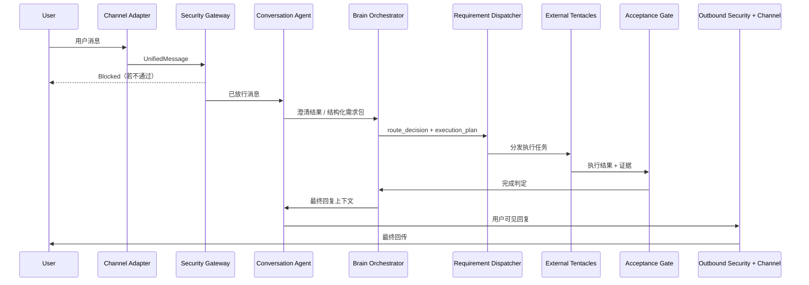

# Brain Optimized Workflow Design

更新时间：2026-04-19

## 1. 文档目的

本文件用于把当前项目的主脑工作流整理为一版更稳的正式设计，目标是：

- 保留现有“主脑封闭、触手外置、协议统一”的总体方向
- 明确各 Agent 与主脑内核的职责边界
- 把“接待、派工、执行、验收、回传”拆成可审计、可回放、可扩展的闭环
- 为后续重构和验收提供统一口径

---

## 2. 现状判断

## 2.1 当前方案为什么是合理的

你提出的主流程方向是对的：

`渠道接入 -> 安全处理 -> 对话澄清 -> 任务拆解/下发 -> 外接触手执行 -> 完成判定 -> 用户回传`

它符合当前仓库已经形成的主链原则：

- 统一消息入口
- 安全前置
- 主脑负责裁决
- 外接触手负责执行
- 结果统一回传用户

与当前实现对齐的主链可概括为：

`channel/webhook -> message_ingestion -> security_gateway -> brain_core(coordinator/reception/routing/orchestration/manager) -> workflow/agent execution -> channel_outbound`

## 2.2 当前描述里最需要优化的地方

当前口径仍有 4 个容易导致后续架构变形的点：

1. `安全 Agent` 被描述为“监听用户和对话 Agent 的对话”  
   这会把安全能力误缩成旁路监听。更稳的模型应是“前置安全闸门 + 执行中风险复核 + 出站审查”。

2. `任务下发 Agent` 既分配任务又判定完成  
   这会让“派工”和“验收”混在一起，长期容易出现自证完成、缺少客观验收标准的问题。

3. `对话 Agent` 只在前面出现一次  
   如果结果直接由执行层或出站层返回，用户会感受到多个后台模块在说话，体验不统一。

4. `外部触手` 的边界不够硬  
   外接触手只能执行，不能回写主脑裁决、审计真源、任务真源和安全结论。

---

## 3. 优化后目标原则

优化后的正式设计建议固定为以下 6 条原则：

1. 主脑只保留裁决、状态机、审计、记忆治理与验收，不承载触手实现。
2. 安全必须前置，不允许任何外部请求绕开统一安全链进入编排。
3. 对外只暴露一个统一人格，内部可以多 Agent 协作。
4. 派工与验收分离，避免“谁派工谁验收”。
5. 触手只负责执行和返回证据，不拥有主脑真相源写权限。
6. 回传前再次做安全与结果适配，防止执行产物直接裸回用户。

---

## 4. 优化后正式工作流

推荐把主链口径固定为：

`Channel -> Security Guardian -> Security Agent -> Conversation Agent -> Brain Orchestrator -> Requirement Dispatcher -> Tentacles -> Brain Orchestrator -> Security Guardian -> Conversation Agent`

建议把正式工作流定义为 10 个阶段：

1. 渠道接入  
   渠道 Adapter 只负责解析消息、验签、基础限流、统一成 `UnifiedMessage`。

2. 前置安全网关  
   统一执行认证、限流、注入检测、内容改写、审计写入。未通过则直接阻断，不创建任务副作用。

3. 对话接待与需求澄清  
   `Conversation Agent` 负责判断当前是闲聊、澄清、补充上下文、明确任务还是待确认事项。

4. 主脑项目经理裁决  
   主脑生成 `manager_packet`、`route_decision`、`execution_plan`，决定是否进入任务化执行。

5. 任务拆解与派工  
   `Requirement Dispatcher` 负责把需求转成稳定的执行路线，选择外接触手、执行模式和回退策略。

6. 外接触手执行  
   外接 Agent / MCP / Skill / 子工作流只执行任务，返回结果、引用、证据和失败原因。

7. 主脑验收与完成判定  
   主脑根据结果完整度、证据、失败情况和用户原始目标，判定 `完成 / 部分完成 / 失败 / 需要补问 / 需要确认`。

8. 出站安全审查  
   对执行结果做脱敏、越权检查、敏感信息审查和渠道适配前过滤。

9. 对话 Agent 统一对外回复  
   `Conversation Agent` 基于验收结论生成最终面向用户的话术，统一口吻和上下文承接。

10. 记忆蒸馏与审计归档  
   主脑把可保留内容进入短期/中期/长期记忆，把关键裁决、派工、验收、回传过程写入审计真源。

---

## 5. 推荐时序图

---

## 6. 角色边界

| 角色 | 负责什么 | 不负责什么 |
|------|----------|------------|
| Channel Adapter | 渠道验签、基础接入、防重、统一消息对象 | 不做业务裁决，不做任务验收 |
| Security Guardian / Security Gateway | 入站、执行前、出站三段安全闸门；最终 `allow/rewrite/block`；脱敏、处罚状态、审计真源 | 不负责需求澄清、任务派发、外部执行、结果润色 |
| Security Agent | 语义风险分析、注入/越权识别、风险标签、审批建议 | 不负责最终放行裁决、权限系统、任务分发、外部执行 |
| Conversation Agent | 接待、澄清、补齐上下文、生成结构化需求包、统一对外回复与结果解释 | 不负责安全裁决、任务派发、外部执行、完成态判定 |
| Brain Orchestrator | `route_decision`、`manager_packet`、`execution_plan`、状态机推进、结果汇总、完成验收、回传决策 | 不直接扮演对外人格，不直接实现触手能力，不绕过安全链 |
| Requirement Dispatcher | 任务拆解、派工、回退策略、执行说明与 `handoff packet` 生成 | 不负责最终完成判定，不直接替代触手执行，不改写安全结论 |
| External Tentacles | 搜索、写作、CRM、PDF、自动化等具体能力执行与证据回传 | 不改写主脑审计、任务真源和安全结论 |
| Acceptance Gate | 对结果做完成度、证据、失败原因和补问需求判定 | 不直接与用户对话 |
| Channel Outbound | 渠道回传、格式适配、失败重试 | 不产生业务裁决 |

---

## 7. 最容易混淆的边界

以下边界必须明确写死：

1. `Security` 不等于“旁路监听器”  
   它必须在入口前置，也必须参与高风险执行和出站复核。

2. `Security Guardian` 不等于 `Security Agent`  
   前者持有最终安全闸门和审计真源，后者只提供语义级风控分析与建议。

3. `Conversation` 不等于“执行 Agent”  
   它负责接人、澄清、解释，不负责真正干活。

4. `Conversation Agent` 不等于 `Requirement Dispatcher`  
   前者负责“用户到底要什么”，后者负责“系统应该怎么派工”。

5. `Requirement Dispatcher` 不等于“Acceptance Gate”  
   它负责把活派出去，不负责宣布这件事已经完成。

6. `Requirement Dispatcher` 不等于 `Brain Orchestrator`  
   前者只产出执行路线与 handoff，后者负责全局流程、重试、汇总和验收。

7. `Tentacles` 不等于“主脑第二套裁决链”  
   它们不能在主脑之外演化出另一套路由、审批、审计和记忆真源。

8. `Channel Outbound` 不等于“最终回复人格”  
   它只负责送达，最终用户可见语义应由 `Conversation Agent` 统一。

---

## 8. 推荐状态机

建议采用双层状态机，而不是把所有语义都塞进一个字段。

### 8.1 状态机分层

- `task.status`：只表达任务终态与粗粒度执行态  
  推荐取值：`pending | running | completed | failed | cancelled`

- `dispatch_context.state`：只表达流程细态  
  推荐取值：`received | normalized | security_checked | clarifying | context_patched | planned | awaiting_confirmation | dispatch_queued | dispatching | dispatched | agent_queued | executing | acceptance_review | accepted | partial_accepted | rejected | outbound_pending | outbound_sent | outbound_failed | security_blocked | manual_handoff_required`

这样可以避免一个 `completed` 同时表示：

- 业务验收已经通过
- 渠道消息已经成功回传
- 整个任务彻底闭环

建议明确拆成：

`accepted -> outbound_pending -> outbound_sent`

### 8.2 任务主状态

建议把主流程抽象成以下主状态：

- `ingress_received`
- `security_review`
- `blocked`
- `awaiting_clarification`
- `awaiting_confirmation`
- `planning`
- `dispatching`
- `executing`
- `acceptance_review`
- `outbound_review`
- `completed`
- `partially_completed`
- `failed`
- `cancelled`

### 8.3 关键流转

1. `ingress_received -> security_review`
2. `security_review -> blocked`
3. `security_review -> awaiting_clarification`
4. `security_review -> planning`
5. `planning -> awaiting_confirmation`
6. `planning -> dispatching`
7. `dispatching -> executing`
8. `executing -> acceptance_review`
9. `acceptance_review -> awaiting_clarification`
10. `acceptance_review -> outbound_review`
11. `outbound_review -> completed`
12. `outbound_review -> partially_completed`
13. 任意执行阶段可进入 `failed` 或 `cancelled`

更细的推荐细态链路可表述为：

`received -> normalized -> security_checked -> clarifying/context_patched -> planned -> awaiting_confirmation(可选) -> dispatch_queued -> dispatching -> dispatched -> agent_queued(可选) -> executing -> acceptance_review -> accepted/partial_accepted/rejected -> outbound_pending -> outbound_sent/outbound_failed`

终态补充建议：

- `security_blocked`
- `failed`
- `cancelled`
- `manual_handoff_required`
- `completed`

### 8.4 每阶段阻塞条件

| 阶段 | 阻塞条件 |
|------|----------|
| security_review | 验签失败、注入风险、越权、频率限制、敏感内容未改写 |
| awaiting_clarification | 用户目标不完整、输入缺关键参数、结果不足以直接交付 |
| awaiting_confirmation | 专业工作流、风险动作、成本高动作、用户未确认 |
| dispatching | 无可用触手、能力不匹配、租户/环境不匹配 |
| executing | 触手超时、失败、证据缺失、结果为空 |
| acceptance_review | 结果与用户目标不匹配、引用不足、关键步骤未完成 |
| outbound_review | 出站内容含敏感信息、渠道目标缺失、渠道能力不支持 |

### 8.5 每阶段验收条件

| 阶段 | 验收条件 |
|------|----------|
| 接入 | 消息已标准化，`trace_id / user_key / session_id` 已生成，入口身份合法 |
| 安全 | `allow/rewrite` 已落审计，后续链路只接收脱敏文本，被拦截请求无副作用 |
| 澄清 | 目标、范围、交付物、约束、确认要求齐全 |
| 派工 | `workflow_id` 或 `execution_agent_id` 已确定，`dispatch_context` 已持久化，`next_owner` 明确 |
| 执行 | 节点已认领，开始时间或心跳存在，结果与证据已回传 |
| 验收 | 交付物完整，结果可验证，外部副作用可核对，结果安全可出站 |
| 回传 | 已生成对外回复，渠道绑定有效，`delivery_status` 已记录且可回放 |

---

## 9. 验收判定规则

建议把“完成”定义拆成 4 类，而不是简单二元：

1. `completed`  
   用户目标已满足，结果可直接交付，证据和回传都完整。

2. `partially_completed`  
   已完成一部分，但仍有缺口，需要用户决定是否继续。

3. `needs_clarification`  
   执行结果不足以闭环，需要回到对话层补问。

4. `failed`  
   当前无法继续，需要明确失败原因和建议下一步。

验收器至少应检查：

- 是否达成原始用户目标
- 是否包含必要引用、证据或结构化结果
- 是否存在明显漏步骤
- 是否触发出站安全风险
- 是否需要用户再次确认

推荐补充回退规则：

- `security_blocked`：直接终止，只保留审计，不创建 task/run，不写 active task cache
- `awaiting_clarification`：保持 `task.status=pending`，不派工，只回到对话层补问
- `awaiting_confirmation`：`confirm -> dispatch_queued`，`cancel -> cancelled`，超时默认不自动执行
- `dispatch_failed`：先同策略重试，再尝试 fallback route，仍失败则转 `manual_handoff_required`
- `execution_timeout / agent_execution_failed`：允许一次基于原上下文快照的安全重试，再失败则转人工接管
- `acceptance_rejected`：回退到 `planned` 或 `dispatch_queued`，附 `rejection_reason`，禁止直接成功回传
- `partial_accepted`：允许阶段性回传，但主任务不应直接标记为完全完成
- `outbound_failed`：执行结果保留为已验收，不重跑执行，只允许重放回传

---

## 10. 与当前仓库的落点映射

下列模块已经可以承接这版设计，不需要推翻重来：

- 统一入口：`backend/app/services/message_ingestion_service.py`
- 前置安全：`backend/app/services/security_gateway_service.py`
- 主脑裁决：`backend/app/brain_core/coordinator/`
- 接待澄清：`backend/app/brain_core/reception/`
- 路由与计划：`backend/app/brain_core/routing/`
- 编排与任务构建：`backend/app/brain_core/orchestration/`
- 状态视图：`backend/app/brain_core/task_view/`
- 执行推进：`backend/app/services/workflow_execution_service.py`
- 执行产出：`backend/app/services/agent_execution_service.py`
- 渠道回传：`backend/app/services/channel_outbound_service.py`

但还建议继续收口以下能力：

- 把“最终对外回复人格”更明确地收口到 `Conversation Agent`
- 把“完成判定”从 `Requirement Dispatcher` 语义中剥离出来，单独定义为主脑验收职责
- 把“出站前安全审查”从概念上提升为正式阶段，而不是仅视作发送前小逻辑

---

## 11. 不建议采用的设计

以下做法不建议继续强化：

1. 安全 Agent 只监听对话，不做入口闸门。
2. Requirement Dispatcher 既派工又验收。
3. 执行结果不经统一对话人格，直接由执行层原样吐给用户。
4. 外接触手拥有任务、审计、安全真源的写权限。
5. 在主脑外部复制第二套路由或审批链。

---

## 12. 建议的落地顺序

建议分 3 期推进：

### Phase 1：文义收口

- 固定正式工作流口径为本文件版本
- 在团队内统一“派工不等于验收”的定义
- 固定 `Conversation Agent` 为统一对外人格

### Phase 2：状态机补点

- 补齐 `acceptance_review` 与 `outbound_review` 的显式阶段定义
- 把“部分完成 / 需补问 / 需确认”从隐式逻辑升级为显式结果类型
- 为回传失败补统一回退口径

### Phase 3：生产验收

- 在真实外接拓扑下验证安全、派工、验收、回传闭环
- 补正式环境下的多实例一致性验证
- 留存完整证据包

---

## 13. 最终结论

当前项目不需要推翻重做。

正确的方向不是把系统改成“更多独立 Agent 串行传球”，而是：

- 保持主脑是唯一裁决中心
- 把安全做成前后双闸
- 把对话做成统一对外人格
- 把派工与验收拆开
- 把触手限制为纯执行层

这会比“安全监听 + 对话 + 任务下发 + 执行 + 直接回传”的模型更稳，更适合生产化。
